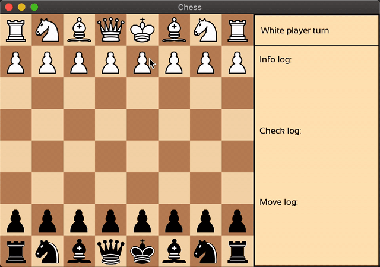

# Chess

## Content

- [Description](#description)
- [Preview](#preview)
- [Required software](#required-software)
- [Installation](#installation)
- [Tested systems](#tested-systems)
- [License]($license)

## Description
Implementation of classic Chess game written on C++

## Preview:

## Required software:
  - any `C++ compiler` supported `17 standard` and higher;
  - `make`;
  - `cmake` `v3.17` and higher.

## Installation
>**1) git clone --recursive [`https://github.com/Hvvang/Chess.git`](https://github.com/Hvvang/Chess.git)**  
>**2) `cd Chess`**  
>**3) `cmake . -Bbuild && cmake --build ./build`**
>**4) `cd build/app && ./chess`**

## Tested Systems:
- macOS Catalina `v10.15.7`;
- Ubuntu `v18.4`.

## License
Collision is an open-sourced software licensed under the [MIT license](LICENSE).

